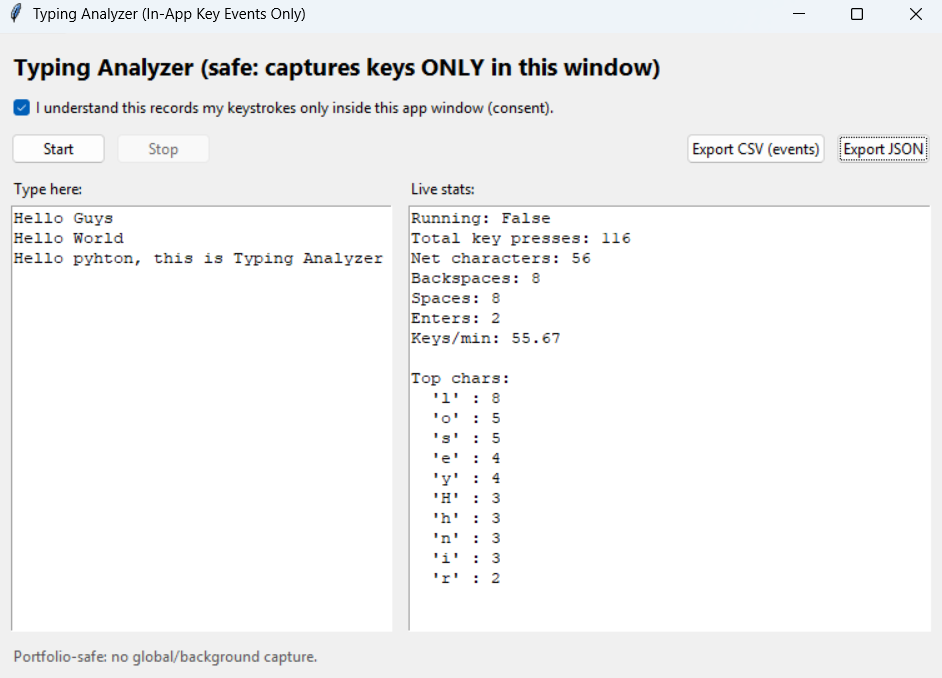

# Keystroke Dynamics Analysis


A lightweight **Python desktop application** that analyzes typing activity and keyboard usage patterns within an application window.

The program records keyboard events while typing, calculates typing statistics, and allows exporting session data in **JSON and CSV formats**.
The project demonstrates **event-driven programming, GUI development, automated testing, and CI/CD workflows**.

---

# Application Preview



The interface allows users to start a typing session, monitor keyboard activity, and export session analytics.

---

# Key Features

* Tkinter-based **desktop GUI**
* Real-time typing statistics
* Keyboard event tracking within the application window
* Export typing session data
* JSON and CSV data export
* Modular Python code structure
* Automated testing using **pytest**
* Continuous Integration using **GitHub Actions**

---

# Typing Metrics Generated

The application tracks and calculates:

* Total key presses
* Net characters typed
* Backspace usage
* Space and Enter key counts
* Keys per minute (KPM)
* Most frequently used characters

These statistics help analyze typing behavior and keyboard usage patterns.

---

# Project Structure

```text
keyboard-typing-analyzer
│
├── app.py
├── analyzer.py
├── export_utils.py
│
├── tests
│   └── test_analyzer.py
│
├── screenshots
│   └── app-interface.png
│
├── .github
│   ├── workflows
│   │   └── python-tests.yml
│   └── ISSUE_TEMPLATE
│       └── bug_report.md
│
├── CONTRIBUTING.md
├── README.md
├── LICENSE
└── .gitignore
```

---

# Technologies Used

* Python
* Tkinter
* Pytest
* JSON
* CSV
* GitHub Actions

---

# Installation

Clone the repository:

```bash
git clone https://github.com/joshuvavinith/keystroke-dynamics-analysis.git
cd keystroke-dynamics-analysis
```

Create a virtual environment:

### Windows

```bash
python -m venv venv
venv\Scripts\activate
```

### macOS / Linux

```bash
python3 -m venv venv
source venv/bin/activate
```

Install dependencies for testing:

```bash
pip install pytest
```

---

# Running the Application

Run the program using:

```bash
python app.py
```

This will open the typing analyzer interface.

---

# Usage

1. Enable the **consent checkbox**
2. Click **Start** to begin recording
3. Type inside the text area
4. Click **Stop** to end the session
5. Export results as **JSON or CSV**

---

# Running Tests

Run automated tests using:

```bash
pytest
```

---

# Continuous Integration

This project uses **GitHub Actions** to automatically run tests on every push or pull request.

The CI pipeline ensures:

* Code stability
* Automated verification of functionality
* Maintainable development workflow

---

# Contributing

Contributions are welcome.

To contribute:

1. Fork the repository
2. Create a new feature branch
3. Make your changes
4. Submit a pull request

Please refer to **CONTRIBUTING.md** for detailed guidelines.

---

# Security & Ethics

This project **does not perform global keylogging**.

Keyboard events are captured **only within the application window**, making it safe for educational and demonstration purposes.

The software should **not be used to monitor users without their consent**.

---

# Educational Context

This project originated from a **college value-added cybersecurity course** focused on keyboard event monitoring in Python.

It has been redesigned into a **portfolio-ready typing analysis tool** demonstrating modern software engineering practices.

---

# License

This project is licensed under the **MIT License**.
